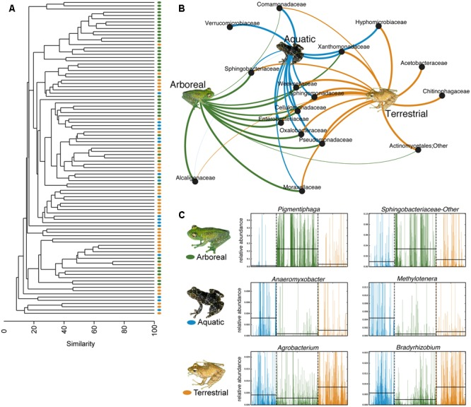

I like this figure from the paper *Host ecology rather than host phylogeny drives amphibian skin microbial community structure in the biodiversity hotspot of Madagascar* by Bletz et al. (2017) in the journal [Frontiers in Microbiology]( https://pubmed.ncbi.nlm.nih.gov/28861051/). 

I read this article when I was learning about phylosymbiosis, which describes a pattern in which closely related taxa host more phylogenetically similar microbial communities than do host taxa that are less closely related. The study described in this article sequenced skin microbial communities of 84 species of frogs from Madagascar to test for the presence of a phylosymbiotic pattern. The authors also hypothesized that the frogs’ ecological associations (whether they were primarily arboreal, terrestrial, or aquatic), could be strong determinants of the structure and membership of their microbial communities.

I chose this figure because I thought it was a somewhat original and effective way to communicate a message about microbial communities, which are often depicted in ways that make take-home messages hard to interpret. First, the authors used an intuitive color scheme to tie together three panels that presented different, but complementary information. Each color corresponded to an ecotype (the main finding of the paper was that microbial community structure and membership correlated with ecotype but not phylogeny). Next, the authors chose to represent some select microbial taxa that were highly associated with particular ecotypes by showing a plot with raw data in the background, and mean as a black bar. I liked this because I find that these results are usually presented in tables, and authors rarely manage to show raw data and summary stats together. In sum, I thought this was a really well-done figure that told much of the big story of the study in an easy-to-follow graphic. 
