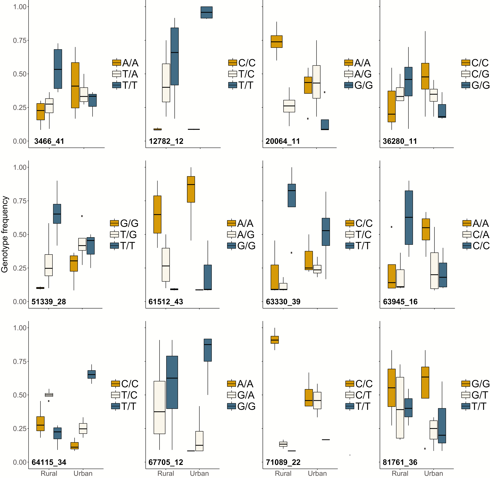

This week I'm commenting on a figure from the paper *Replicated Landscape Genomics Identifies Evidence of Local Adaptation to Urbanization in Wood Frogs* in the  [Journal of Heredity](https://academic.oup.com/jhered/article/110/6/707/5529283?login=true#164267378).

This paper used ddRAD-Seq to look at whether wood frogs living in urban environments undergo parallel evolution due to urban specific selection factors. The authors used wood frogs from four paired urban and non-urban replicate locations, and identified genotypes that showed evidence of directional selection across replicates. They presented the following figure to highlight 12 loci that showed evidence of directional selection based on the environment of the frog, and the genotypes indicating selection. 

My main complaint with this figure is that the same colors are used to communicate different genotypes. For example, for urban frogs, the T/T genotype of the 12782_12 locus and the G/G genotype of the 67705_12 locus are nearly fixed. However, they are both shown in blue. I found the scheme of facetting the boxplots showing genotype frequencies by environment, by the locus identity a bit hard to follow. Specifically, I found it difficult to compare urban versus rural frogs to assess how their genotypes vary by locus. 

In making changes to the figure, I realized that there may not be a great way to convey all of this data in one figure. I chose to make the boxplots horizontal, and to facet the graphs based on the type of SNP (with the x axis showing the frequency of each SNP/genotype). This was an improvement in the sense that it allowed me to more directly compare urban and rural frogs' genotype frequencies by locus, but it was also a failure in that the number of loci being shown (12) is too many to display with color. I now understand why the authors recycled color in this figure...

![new]
