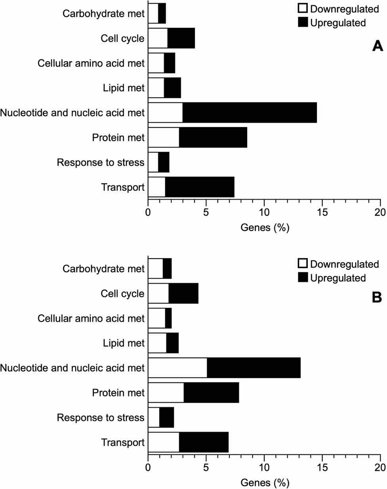
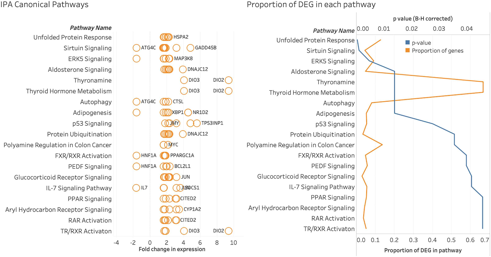
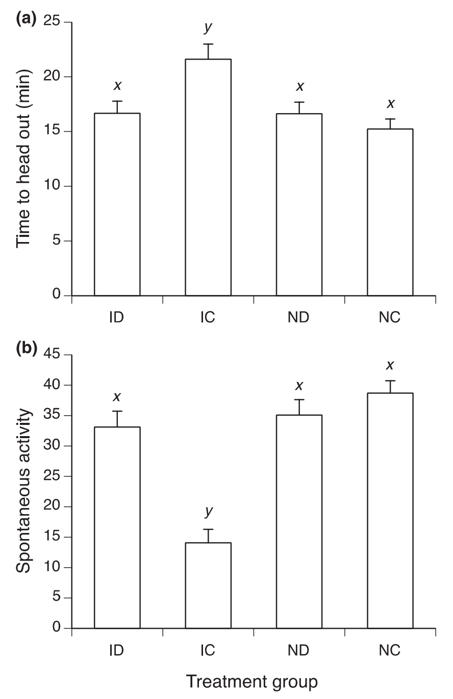
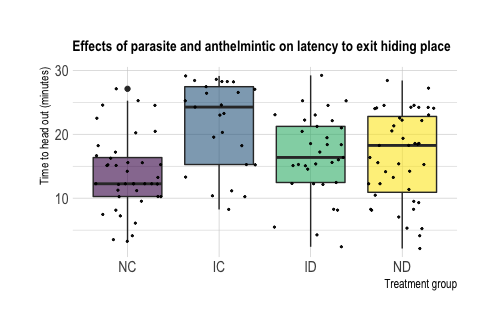
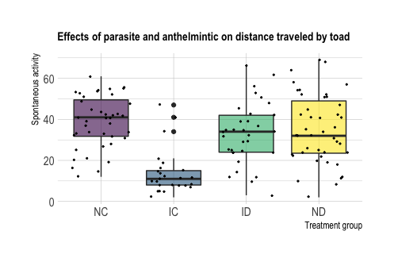

## 2 February 2021

This week I focused on studies that looked at the transcriptomes of non-model organisms. I plan to do a lot of this in the coming months, so I wanted to get a feel for how folks tend to visualize these types of data. I quickly came to the conclusion that I'm not a big fan of most of the visualization techniques used for data showing differential gene expression or changes to gene regulation. However, I found two examples of figures to illustrate some things that have helped me learn about what I want to do. 

**First, the figure I would do differently.** I took this figure from the paper "Hepatic transcriptome of the freeze-tolerant Cope's gray treefrog, *Dryophytes chrysoscelis*: Responses to cold acclimation and freezing" by Clara do Amaral et. al, 2020, in the journal BMC Genomics.

**Figure caption** Genes differentially expressed in cold (top) and frozen (bottom) Cope's gray treefrogs, organized by biological process category (modified from doAmaral et al. 2020). 

I don't think this is a bad figure, but I think it missed an easy opportunity to visualize data more intuitively. The figure uses color to indicate whether gene expression was up- or down-regulated. On the X axis, the figure shows the percentage of genes in each category of biological processes that were up- or down- regulated, and on the Y axis, the figure indicates the category of biological processes to which each group of genes correspond. The fact that the bars for down-regulated genes append the bars for up-regulated genes is confusing to me. To make this figure more immediately informative, I would allow the bars for up- and down-regulated genes to extend in opposite directions. It feels more natural to me to allow both sets of bars for each category start at zero, and end at the respective percentages of genes that were expressed that they comprise. Additionally, the interesting take-home of this figure, for me, is really the difference in differential gene expression between frogs in two treatments. I would prefer to see the color scheme diverge according to *treatment* and would like to see the bars for each treatment group and biological process category stacked next to or on top of each other.   

**Next, a plot I liked more!** This figure comes from the paper "Transcriptome analysis indicates a broad range of toxic effects of Deepwater Horizon oil on Seaside Sparrows" by A. Bonisoli-Alquati et al.,2020 in the journal [Science of the Total Environment](https://www.sciencedirect.com/science/article/pii/S0048969720310949?casa_token=GhSnNaYC7yoAAAAA:qLfKqH1RT1iaDogbNtn0MrL2QDLV4ylkew5C7baDoWRL5HGjZsgj8ADOTzmbxtVnIdytdZ267g)

**Figure caption** Canonical pathways enriched in Seaside Sparrows exposed to the Deepwater Horizon oil spill, relative to control birds that were not exposed (left panel). Pathways were considered enriched due to a high degree of differential gene expression, and by a high proportion of genes in the pathway being among the genes that were differentially expressed (right panel). Caption modified from Bonisoli-Alquati et al., (2020).  

The first thing I like about this figure is that the data are split into two panels which indicate differential expression in fold change for each pathway (left panel) and proportion of differentially expressed genes in each pathway (on the right). The canonical pathways are ordered vertically so that the data for each pathway can be easily assessed for both types of data. The two lines on the right panel use colors and differnt horizontal axes to indicate which statistic they represent. Both statistics are important, and often this type of data would be presented in a table, but the authors made a cool choice to graph these data. Not only are they easy to interpret, and prettier than a table, but they are much more easily connected to the panel on the left, which improved my understanding of how the authors interpreted their data and reached their conclusions! 

## 3 March 2021
This week we talked about displaying uncertainty. I would have preferred to show a uncertainty in model predictions, but I haven't landed on the best way to do that, so I'll show what I got to, and explain how I got there. 

I worked on a small subset of data in the paper "The costs of parasite infection: Effects of removing lungworms on performance, growth and survival of free-ranging cane toads" by Finnerty et al., 2018, in [Functional Ecology](https://besjournals.onlinelibrary.wiley.com/doi/epdf/10.1111/1365-2435.12992).

The authors studied the effects of infection with the nematode *Rhabdias pseudospaerocepha* on invasive cane toads in Australia. Part of their study looked at the combined effects of nematode infection and treatment with anthelmintic drugs on toad latency (how readily it would leave a hiding place) and activity (how much ground it covered in a given time). They referred to these measurements as "Time to head out(min)" and "Spontaneous activity", respectively. 

They reported means and standard errors for these measures with bar charts, which doesn't allow for us to see the spread of their data. 

The authors also reported the main effects of Trial (which time they tested the toads), Infection group (the treatment combination of infection/control + drug/control for each toad), and the interaction between these effects. The authors did not include parameter estimates or confidence intervals for these calculations. Though there was a strong effect of infection group (P = 0.02), we only have bar charts to inform how the effect manifests among different treatment groups. 

My first objective was to remake their bar charts as boxplots that show the raw data as points.

